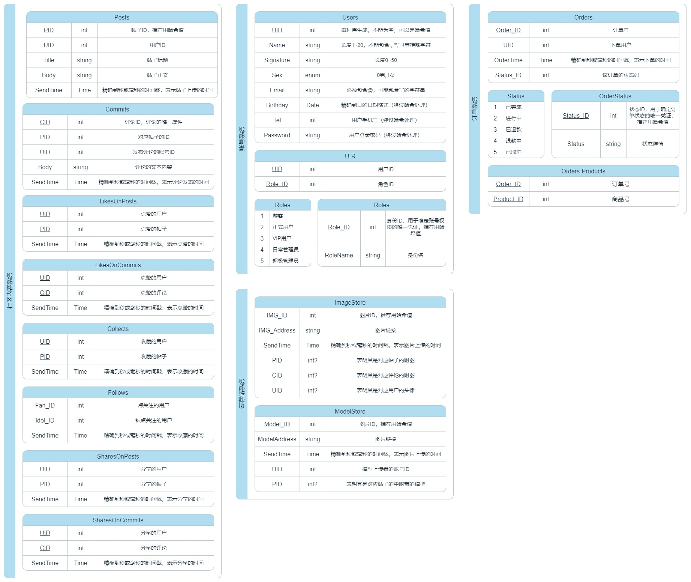
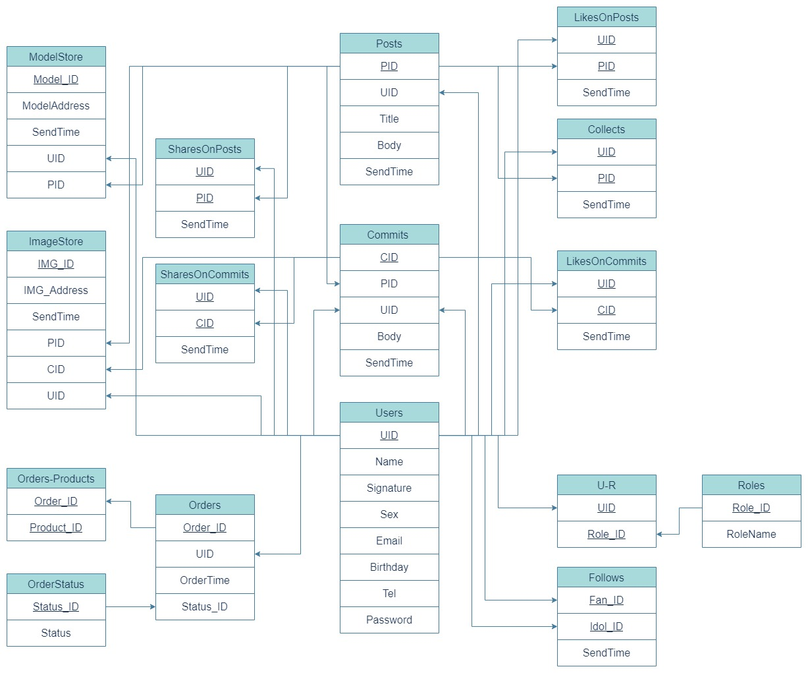

# 社区功能设计方案

## 数据库

主要负责存取社区内容相关的资源与信息，包括用户资料、用户信息、社区帖子内容等等。我们决定采用市面上主流的两种数据库MySQL和Redis搭配对象存储技术来实现。选择MySQL作为基底用来存储所有数据，并把常用的数据拷贝到Redis来实现高性能读取，其中一部分大文件，如用户上传的各种图片，LoRA模型文件等，如果存入数据库当中，会影响数据库的查询性能，因此我们选择MinIO作为对象存储的系统，负责这些大文件的管理，并在数据库中存入对应文件的地址信息，以便查找。

基于上述思路，我们设计了如下图一所示的SQL结构，并根据每个数据之间的关系进行连接做出了如下图二的数据库表关系网

## 服务端

我们有了存储数据的地方之后，需要有一个接收并处理数据的服务端，这部分将集成AI部分的核心内容，因此性能问题值得考量。最终我们选择了面向Java语言的Spring框架+SpringBoot，Java被认为是一种常青的编程语言。它的一个常见用途是在后端开发中。Spring框架是最好的Java框架之一。这一框架上手相对简单，学习成本较低，更适合我们这种工作量大的项目，而且Spring框架+SpringBoot的性能优秀，开发者社区活跃度也极高，非常适合我们学习使用。

## 网页端

为了方便管理社区内容以及及时查看服务器的运行状况，我们选择使用Vue框架、Element-UI框架参考著名的GitHub开源项目Vue Element Admin构建一套相对完整的后台管理网站，登录有相应权限的账号即可浏览社区的全部内容并实现删除、冻结等操作，便于我们维护社区生态。

## 客户端

作为一款面向大众用户的产品，为了能够既考虑到电脑端用户的体验，同时考虑到手机、平板等移动端用户的体验，我们将学习有关响应式开发的内容，根据用户使用的设备来展示相应的界面，尽量保证用户在不同设备上都能有非常不错的体验。我们将先考虑使用Vue框架和Element-UI框架构建响应式网页界面。

### 客户端功能

客户端在第一次打开时将先提示用户输入账号密码完成登录，然后进入社区主界面，主界面UI布局以Google的设计规范为准，参考国内社区交流软件，如QQ空间，微博，以及国外社交软件如X等进行搭建。
